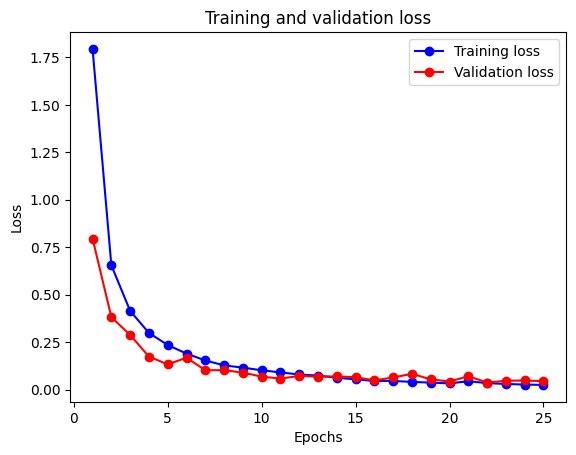
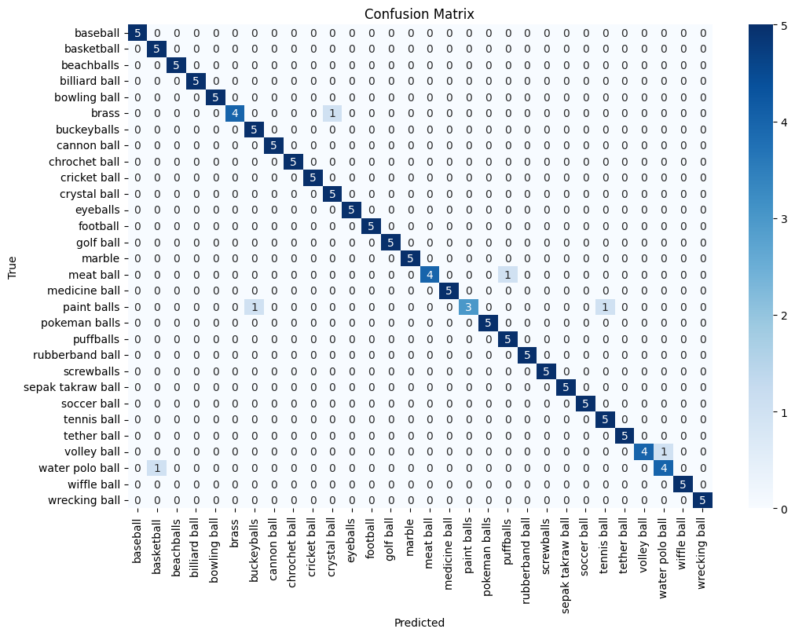

# Model

Pretrained resnet18 model with the final layer retrained. No data preprocessing, using a cross entropy loss function and vanilla stochastic gradient descent with a learning rate of 0.1.

```py
import torch
import torch.nn as nn
import torch.optim as optim
import torch.nn.functional as F
import matplotlib.pyplot as plt
import torchvision.models as models

# Load a pre-trained model and modify the final layer
model = models.resnet18(pretrained=True)
model = model.to(device)
num_features = model.fc.in_features
model.fc = nn.Linear(num_features, len(train_dataset.classes))

# Define loss function and optimizer
criterion = nn.CrossEntropyLoss()
optimizer = optim.SGD(model.parameters(), lr=0.01)

# Training loop
num_epochs = 25
train_losses = []
val_losses = []

for epoch in range(num_epochs):
    model.train()
    running_loss = 0.0
    for inputs, labels in train_loader:
        inputs, labels = inputs.to(device), labels.to(device)
        optimizer.zero_grad()
        outputs = model(inputs)
        loss = criterion(outputs, labels)
        loss.backward()
        optimizer.step()
        running_loss += loss.item()

    avg_train_loss = running_loss / len(train_loader)
    train_losses.append(avg_train_loss)

    model.eval()
    val_loss = 0.0
    correct = 0
    total = 0
    with torch.no_grad():
        for inputs, labels in valid_loader:
            inputs, labels = inputs.to(device), labels.to(device)
            outputs = model(inputs)
            loss = criterion(outputs, labels)
            val_loss += loss.item()
            _, predicted = torch.max(outputs, 1)
            total += labels.size(0)
            correct += (predicted == labels).sum().item()

    avg_val_loss = val_loss / len(valid_loader)
    val_losses.append(avg_val_loss)

    print(f"Epoch {epoch+1}, Training Loss: {avg_train_loss}, Validation Loss: {avg_val_loss}, Validation Accuracy: {100 * correct / total}")

# Plot training and validation loss
epochs = range(1, num_epochs + 1)
plt.plot(epochs, train_losses, 'bo-', label='Training loss')
plt.plot(epochs, val_losses, 'ro-', label='Validation loss')
plt.title('Training and validation loss')
plt.xlabel('Epochs')
plt.ylabel('Loss')
plt.legend()
plt.show()

# Save the model
torch.save(model.state_dict(), 'resnet-sgd.pth')
```

## Training results
```
Epoch 1, Training Loss: 1.794461255579923, Validation Loss: 0.794854336977005, Validation Accuracy: 81.33333333333333
Epoch 2, Training Loss: 0.6541276911718655, Validation Loss: 0.38134934902191164, Validation Accuracy: 92.0
Epoch 3, Training Loss: 0.41429530572047274, Validation Loss: 0.28730976283550264, Validation Accuracy: 94.0
Epoch 4, Training Loss: 0.2978924990227792, Validation Loss: 0.17355451136827468, Validation Accuracy: 97.33333333333333
Epoch 5, Training Loss: 0.23444943162983498, Validation Loss: 0.1323431760072708, Validation Accuracy: 97.33333333333333
Epoch 6, Training Loss: 0.18916778520277117, Validation Loss: 0.16751184314489365, Validation Accuracy: 95.33333333333333
Epoch 7, Training Loss: 0.15313382034676265, Validation Loss: 0.10158161967992782, Validation Accuracy: 96.66666666666667
Epoch 8, Training Loss: 0.12707779314204126, Validation Loss: 0.10192108303308486, Validation Accuracy: 97.33333333333333
Epoch 9, Training Loss: 0.11536052762077445, Validation Loss: 0.08909143805503845, Validation Accuracy: 98.0
Epoch 10, Training Loss: 0.10129339668273399, Validation Loss: 0.06775903776288032, Validation Accuracy: 98.0
Epoch 11, Training Loss: 0.09017498229127542, Validation Loss: 0.05767572484910488, Validation Accuracy: 98.66666666666667
Epoch 12, Training Loss: 0.07912359788881994, Validation Loss: 0.07140248343348503, Validation Accuracy: 98.66666666666667
Epoch 13, Training Loss: 0.07323765419258745, Validation Loss: 0.06823129430413247, Validation Accuracy: 98.0
Epoch 14, Training Loss: 0.0621706758362068, Validation Loss: 0.06886866390705108, Validation Accuracy: 97.33333333333333
Epoch 15, Training Loss: 0.0533718368681395, Validation Loss: 0.06508597433567047, Validation Accuracy: 97.33333333333333
Epoch 16, Training Loss: 0.04520578748356979, Validation Loss: 0.04798768274486065, Validation Accuracy: 98.66666666666667
Epoch 17, Training Loss: 0.0451304407757336, Validation Loss: 0.0633633954450488, Validation Accuracy: 98.66666666666667
Epoch 18, Training Loss: 0.04017015511944758, Validation Loss: 0.08281920906156301, Validation Accuracy: 98.0
Epoch 19, Training Loss: 0.03632909400322664, Validation Loss: 0.05338000599294901, Validation Accuracy: 98.0
Epoch 20, Training Loss: 0.032415444525865325, Validation Loss: 0.04218308087438345, Validation Accuracy: 99.33333333333333
Epoch 21, Training Loss: 0.04351951043838553, Validation Loss: 0.07000643946230412, Validation Accuracy: 98.0
Epoch 22, Training Loss: 0.03369227438275002, Validation Loss: 0.03682974986732006, Validation Accuracy: 99.33333333333333
Epoch 23, Training Loss: 0.02926627823679123, Validation Loss: 0.04601068533957005, Validation Accuracy: 97.33333333333333
Epoch 24, Training Loss: 0.026086019240814235, Validation Loss: 0.04750763410702348, Validation Accuracy: 98.0
Epoch 25, Training Loss: 0.02416891321968452, Validation Loss: 0.043532053381204604, Validation Accuracy: 98.0
```


## Evalutation

```
Test Loss: 0.1337, Test Accuracy: 95.33%
                   precision    recall  f1-score   support

         baseball       1.00      1.00      1.00         5
       basketball       0.83      1.00      0.91         5
       beachballs       1.00      1.00      1.00         5
    billiard ball       1.00      1.00      1.00         5
     bowling ball       1.00      1.00      1.00         5
            brass       1.00      0.80      0.89         5
      buckeyballs       0.83      1.00      0.91         5
      cannon ball       1.00      1.00      1.00         5
    chrochet ball       1.00      1.00      1.00         5
     cricket ball       1.00      1.00      1.00         5
     crystal ball       0.83      1.00      0.91         5
         eyeballs       1.00      1.00      1.00         5
         football       1.00      1.00      1.00         5
        golf ball       1.00      1.00      1.00         5
           marble       1.00      1.00      1.00         5
        meat ball       1.00      0.80      0.89         5
    medicine ball       1.00      1.00      1.00         5
      paint balls       1.00      0.60      0.75         5
    pokeman balls       1.00      1.00      1.00         5
        puffballs       0.83      1.00      0.91         5
  rubberband ball       1.00      1.00      1.00         5
       screwballs       1.00      1.00      1.00         5
sepak takraw ball       1.00      1.00      1.00         5
      soccer ball       1.00      1.00      1.00         5
      tennis ball       0.83      1.00      0.91         5
      tether ball       1.00      1.00      1.00         5
      volley ball       1.00      0.80      0.89         5
  water polo ball       0.80      0.80      0.80         5
      wiffle ball       1.00      1.00      1.00         5
    wrecking ball       1.00      1.00      1.00         5

         accuracy                           0.96       150
        macro avg       0.97      0.96      0.96       150
     weighted avg       0.97      0.96      0.96       150

```
