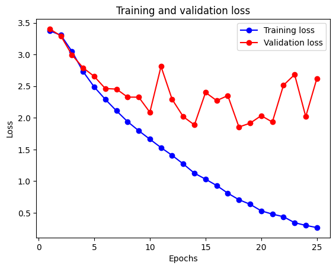
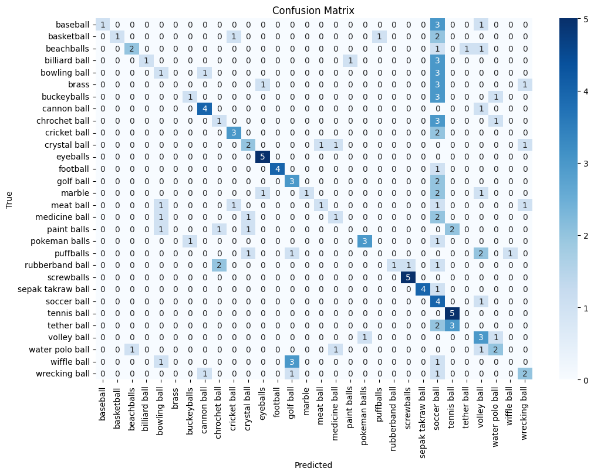

# Model

Simple CNN with 3 convolution and 2 fully connected layers. No data preprocessing, using a cross entropy loss function and vanilla stochastic gradient descent with a learning rate of 0.1.

```py
import torch
import torch.nn as nn
import torch.optim as optim
import torch.nn.functional as F
import matplotlib.pyplot as plt

class SimpleCNN(nn.Module):
    def __init__(self):
        super(SimpleCNN, self).__init__()
        # Convolutional layers
        self.conv1 = nn.Conv2d(in_channels=3, out_channels=32, kernel_size=3, padding=1)
        self.conv2 = nn.Conv2d(in_channels=32, out_channels=64, kernel_size=3, padding=1)
        self.conv3 = nn.Conv2d(in_channels=64, out_channels=128, kernel_size=3, padding=1)

        # Fully connected layers
        self.fc1 = nn.Linear(in_features=128*28*28, out_features=512)
        self.fc2 = nn.Linear(in_features=512, out_features=len(train_dataset.classes))

    def forward(self, x):
        # Convolutional layers with ReLU and max pooling
        x = F.relu(self.conv1(x))
        x = F.max_pool2d(x, 2, 2)

        x = F.relu(self.conv2(x))
        x = F.max_pool2d(x, 2, 2)

        x = F.relu(self.conv3(x))
        x = F.max_pool2d(x, 2, 2)

        # Flatten the output from conv layers
        x = x.view(-1, 128*28*28)

        # Fully connected layers
        x = F.relu(self.fc1(x))
        x = self.fc2(x)

        return x

# Initialize the model
model = SimpleCNN()
model = model.to(device)
# model = torch.compile(model)

# Define loss function and optimizer
criterion = nn.CrossEntropyLoss()
optimizer = optim.SGD(model.parameters(), lr=0.01)

# Training loop
num_epochs = 25
train_losses = []
val_losses = []

for epoch in range(num_epochs):
    model.train()
    running_loss = 0.0
    for inputs, labels in train_loader:
        inputs, labels = inputs.to(device), labels.to(device)
        optimizer.zero_grad()
        outputs = model(inputs)
        loss = criterion(outputs, labels)
        loss.backward()
        optimizer.step()
        running_loss += loss.item()

    avg_train_loss = running_loss / len(train_loader)
    train_losses.append(avg_train_loss)
    
    model.eval()
    val_loss = 0.0
    correct = 0
    total = 0
    with torch.no_grad():
        for inputs, labels in valid_loader:
            inputs, labels = inputs.to(device), labels.to(device)
            outputs = model(inputs)
            loss = criterion(outputs, labels)
            val_loss += loss.item()
            _, predicted = torch.max(outputs, 1)
            total += labels.size(0)
            correct += (predicted == labels).sum().item()
    
    avg_val_loss = val_loss / len(valid_loader)
    val_losses.append(avg_val_loss)
    
    print(f"Epoch {epoch+1}, Training Loss: {avg_train_loss}, Validation Loss: {avg_val_loss}, Validation Accuracy: {100 * correct / total}")

# Plot training and validation loss
epochs = range(1, num_epochs + 1)
plt.plot(epochs, train_losses, 'bo-', label='Training loss')
plt.plot(epochs, val_losses, 'ro-', label='Validation loss')
plt.title('Training and validation loss')
plt.xlabel('Epochs')
plt.ylabel('Loss')
plt.legend()
plt.show()

# Save the model
torch.save(model.state_dict(), 'custom_cnn_model.pth')
```

## Training results
```
Epoch 1, Training Loss: 3.3747840940424827, Validation Loss: 3.4047139167785643, Validation Accuracy: 4.0
Epoch 2, Training Loss: 3.3065943464768672, Validation Loss: 3.2945770263671874, Validation Accuracy: 11.333333333333334
Epoch 3, Training Loss: 3.0505502308364463, Validation Loss: 2.994757604598999, Validation Accuracy: 11.333333333333334
Epoch 4, Training Loss: 2.731498688723134, Validation Loss: 2.7911345243453978, Validation Accuracy: 18.666666666666668
Epoch 5, Training Loss: 2.488283851505381, Validation Loss: 2.6548515796661376, Validation Accuracy: 24.0
Epoch 6, Training Loss: 2.2914429491600106, Validation Loss: 2.462659764289856, Validation Accuracy: 32.666666666666664
Epoch 7, Training Loss: 2.110493901556572, Validation Loss: 2.4544100761413574, Validation Accuracy: 29.333333333333332
Epoch 8, Training Loss: 1.9394130748985088, Validation Loss: 2.32724449634552, Validation Accuracy: 36.666666666666664
Epoch 9, Training Loss: 1.7962156639689892, Validation Loss: 2.326414966583252, Validation Accuracy: 38.666666666666664
Epoch 10, Training Loss: 1.6621748894716786, Validation Loss: 2.087333869934082, Validation Accuracy: 34.666666666666664
Epoch 11, Training Loss: 1.5297397116644194, Validation Loss: 2.8121152400970457, Validation Accuracy: 34.666666666666664
Epoch 12, Training Loss: 1.4067930874571335, Validation Loss: 2.291729378700256, Validation Accuracy: 34.666666666666664
Epoch 13, Training Loss: 1.2714005576825775, Validation Loss: 2.0183340549468993, Validation Accuracy: 44.0
Epoch 14, Training Loss: 1.1254085070264024, Validation Loss: 1.887986946105957, Validation Accuracy: 52.0
Epoch 15, Training Loss: 1.0309050412832108, Validation Loss: 2.4007877349853515, Validation Accuracy: 42.0
Epoch 16, Training Loss: 0.9305014135563268, Validation Loss: 2.272590923309326, Validation Accuracy: 45.333333333333336
Epoch 17, Training Loss: 0.8092224703425854, Validation Loss: 2.3507299184799195, Validation Accuracy: 46.0
Epoch 18, Training Loss: 0.7060836081483722, Validation Loss: 1.8551183938980103, Validation Accuracy: 51.333333333333336
Epoch 19, Training Loss: 0.634473064304453, Validation Loss: 1.9152738809585572, Validation Accuracy: 48.666666666666664
Epoch 20, Training Loss: 0.5303994094771621, Validation Loss: 2.0339095830917358, Validation Accuracy: 50.0
Epoch 21, Training Loss: 0.4789028877837468, Validation Loss: 1.9336485147476197, Validation Accuracy: 51.333333333333336
Epoch 22, Training Loss: 0.43778321226086236, Validation Loss: 2.515290689468384, Validation Accuracy: 46.666666666666664
Epoch 23, Training Loss: 0.3430586480329522, Validation Loss: 2.683398389816284, Validation Accuracy: 47.333333333333336
Epoch 24, Training Loss: 0.3003966085678708, Validation Loss: 2.0195853233337404, Validation Accuracy: 54.666666666666664
Epoch 25, Training Loss: 0.2662359771475328, Validation Loss: 2.6230481624603272, Validation Accuracy: 46.0
```


## Evalutation

```
Test Loss: 3.0586, Test Accuracy: 40.67%
                   precision    recall  f1-score   support

         baseball       1.00      0.20      0.33         5
       basketball       1.00      0.20      0.33         5
       beachballs       0.67      0.40      0.50         5
    billiard ball       1.00      0.20      0.33         5
     bowling ball       0.20      0.20      0.20         5
            brass       0.00      0.00      0.00         5
      buckeyballs       0.50      0.20      0.29         5
      cannon ball       0.67      0.80      0.73         5
    chrochet ball       0.25      0.20      0.22         5
     cricket ball       0.60      0.60      0.60         5
     crystal ball       0.40      0.40      0.40         5
         eyeballs       0.71      1.00      0.83         5
         football       1.00      0.80      0.89         5
        golf ball       0.38      0.60      0.46         5
           marble       1.00      0.20      0.33         5
        meat ball       0.50      0.20      0.29         5
    medicine ball       0.33      0.20      0.25         5
      paint balls       0.00      0.00      0.00         5
    pokeman balls       0.75      0.60      0.67         5
        puffballs       0.00      0.00      0.00         5
  rubberband ball       1.00      0.20      0.33         5
       screwballs       0.83      1.00      0.91         5
sepak takraw ball       1.00      0.80      0.89         5
      soccer ball       0.10      0.80      0.17         5
      tennis ball       0.50      1.00      0.67         5
      tether ball       0.00      0.00      0.00         5
      volley ball       0.27      0.60      0.37         5
  water polo ball       0.40      0.40      0.40         5
      wiffle ball       0.00      0.00      0.00         5
    wrecking ball       0.40      0.40      0.40         5

         accuracy                           0.41       150
        macro avg       0.52      0.41      0.39       150
     weighted avg       0.52      0.41      0.39       150
```
